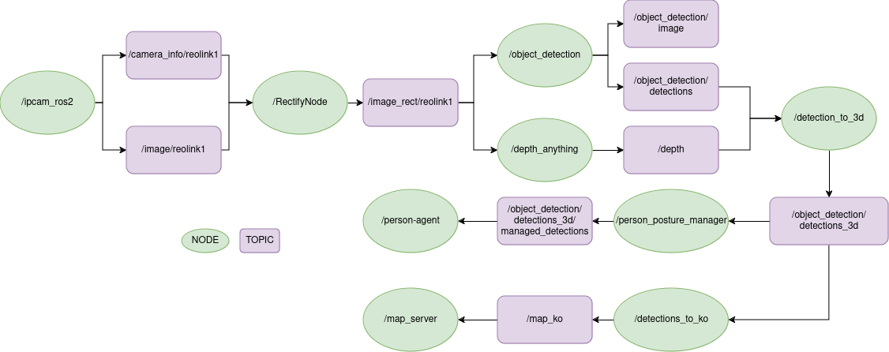

# ros_perception_pipeline


[](https://opensource.org/licenses/Apache-2.0)

## Overview

The `ros_perception_pipeline` package contains a collection of perception-related nodes and tools for ROS2. It is designed to be modular and extensible, allowing users to easily integrate new perception algorithms and sensors into their robotic systems.

The package includes nodes for image processing and object detection as well as tools for visualizing and debugging perception data. It is built on top of the ROS2 framework and follows best practices for ROS2 development.


 

## Installation

### Building from Source

#### Dependencies

- [Robot Operating System (ROS) 2](https://docs.ros.org/en/jazzy/) (middleware for robotics),

#### Building

To build from source, clone the latest version from the main repository into your colcon workspace and compile the package using

```bash
cd colcon_workspace/src
git clone https://github.com/grupo-avispa/ros_perception_pipeline.git
cd ../
rosdep install -i --from-path src --rosdistro jazzy -y
colcon build --symlink-install
```